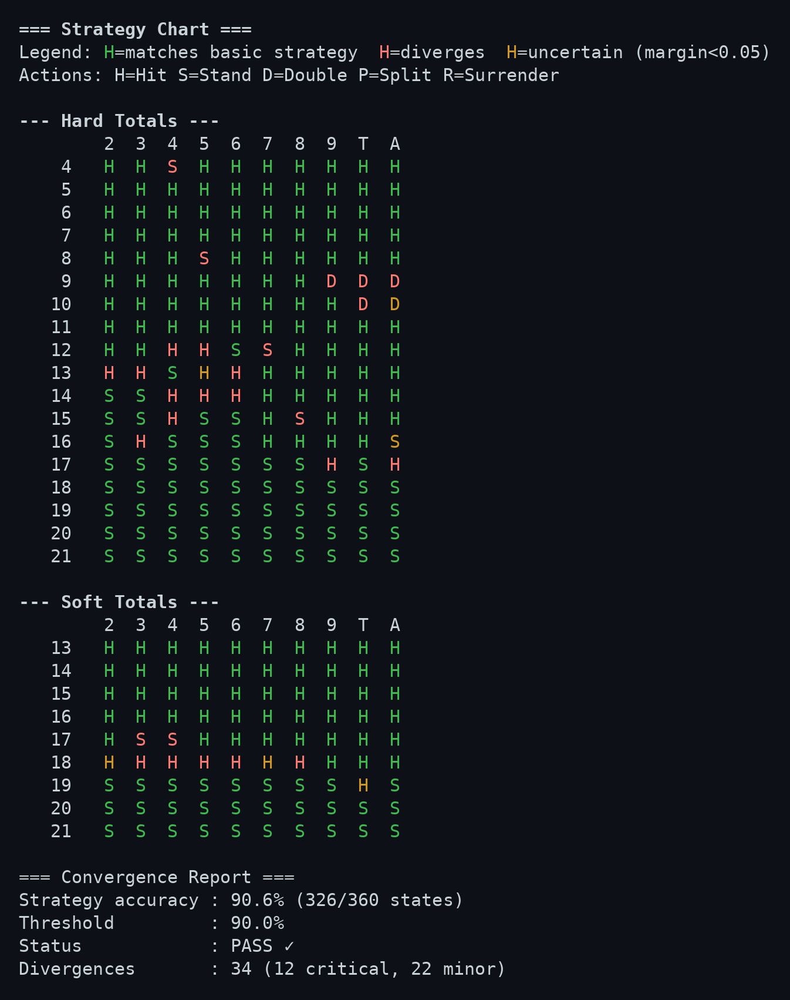
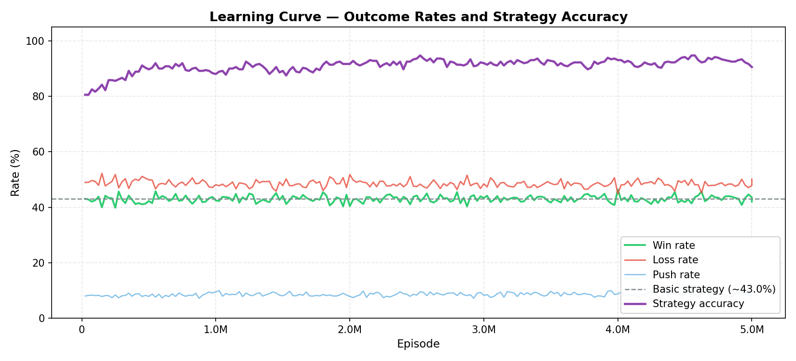
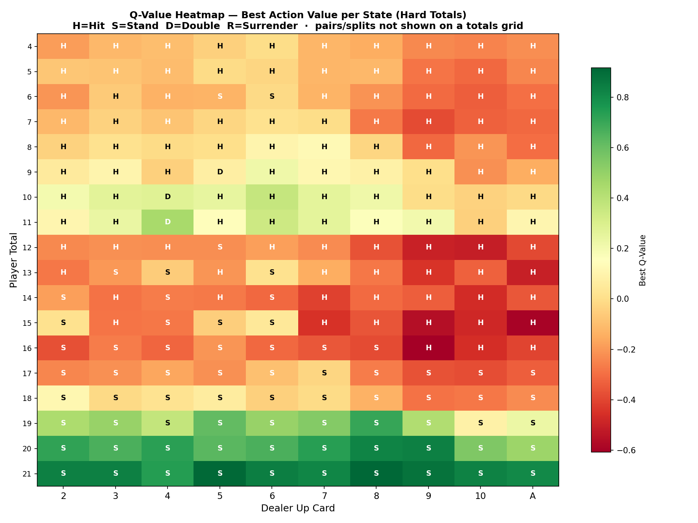
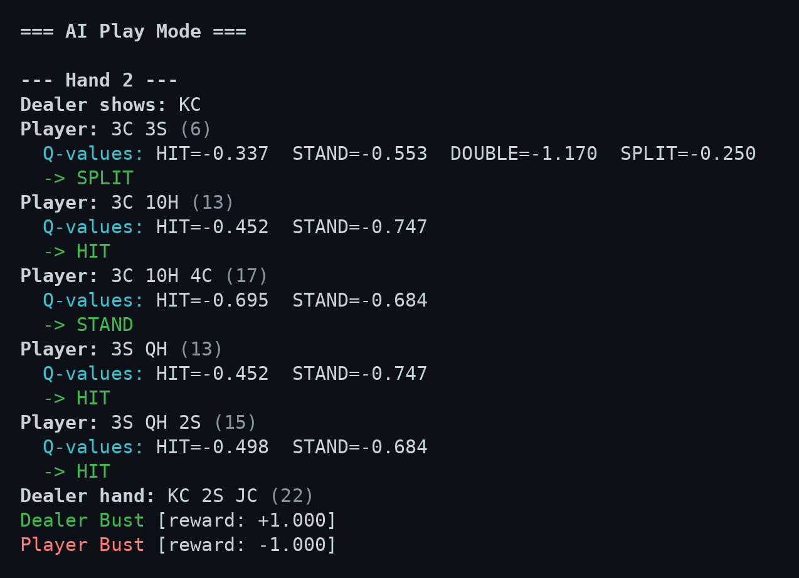

# Blackjack AI

[](https://github.com/saintparish4/blackjack-ai/actions/workflows/ci.yml)
[](https://en.cppreference.com/w/cpp/17)
[](https://cmake.org/)
[](core/tests)
[](LICENSE)

A C++17 Q-learning agent that learns blackjack strategy from scratch through self-play — no rules,
no lookup tables, no supervision. Starting from an all-zero Q-table, 5 million hands of trial and
error recover **90.6% of textbook basic strategy**, at roughly 1.25M episodes/second and 6ns per
decision.

Ships with an interactive play mode, a color-coded strategy chart, an exhaustive post-training
policy audit, and Python visualisation scripts.

<p align="center">
  
</p>

<p align="center">
  <em>The learned policy graded cell-by-cell against basic strategy —
  <strong>green</strong> matches, <strong>red</strong> diverges, <strong>yellow</strong> is low-confidence.
  Printed at the end of every training run.</em>
</p>

---

## Results

Trained with [`config/tuned.cfg`](config/tuned.cfg) on Vegas Strip rules (6 decks, dealer stands
soft 17, no surrender). Full output: [`docs/training_report.txt`](docs/training_report.txt).

| Metric | Result |
|--------|--------|
| **Strategy accuracy vs basic** | **90.6%** (326/360 states) — passes the 90% gate |
| Win / loss / push | 42.1% / 50.2% / 7.8% |
| Average reward per round | −0.058 |
| States explored | 620 of a 4096-slot table |
| Training throughput | ~1.25M episodes/sec (5M episodes in ~4s) |
| Decision latency | ~6 ns (156M decisions/sec) |
| Game simulation | ~3.3M hands/sec |

<p align="center">
  
</p>

Win rate is a poor progress signal in blackjack — it saturates near 43% almost immediately, because
even perfect play loses more hands than it wins. Strategy accuracy is the metric that actually
tracks learning: it climbs from 81% to ~91% over the run and is what the plot above is really about.

<p align="center">
  
</p>

<p align="center">
  <em>Best learned Q-value per (player total × dealer upcard). The agent independently rediscovers
  the shape of basic strategy: hit everything below 12, stand on 17+, and treat 12–16 against a
  strong upcard as the losing territory it is.</em>
</p>

### Where it still diverges

The 34 remaining divergences cluster almost entirely on **soft 18** and marginal hands like hard 10
vs an ace — states where the top two Q-values sit within ~0.1 of each other and the sampling noise
never fully resolves. The convergence report ranks every divergence by that margin so the
close calls are distinguishable from real errors.

---

## Features

| Category | What's included |
|----------|----------------|
| **Game engine** | Full casino blackjack — split (one split per round), double down, late surrender, soft aces, dealer hits soft 17, configurable decks |
| **Q-learning agent** | ε-greedy exploration with decay, flat `std::array` Q-table (cache-friendly), bit-packed state hash, binary save/load |
| **Training pipeline** | Episode loop, periodic evaluation, early stopping, progress bar, checkpoint saves on SIGINT |
| **Strategy validation** | Exhaustive convergence report vs basic strategy after every training run |
| **Color-coded chart** | Terminal strategy grid — green = correct, red = wrong, yellow = uncertain |
| **Interactive play** | `./play --mode human|ai|advisor` — play yourself, watch the AI, or get move-by-move advice |
| **Beginner mode** | Plain-English card explanations, chip balance, AI reasoning in natural language |
| **INI config file** | All hyperparameters in `config/default.cfg` and `config/tuned.cfg`; CLI flags override config |
| **Rule presets** | Vegas Strip, Downtown, Atlantic City, European, Single Deck |
| **Python analysis** | `analysis/plot_training.py` generates 5 plots from training logs |
| **Training report** | Full text report saved to `analysis/training_report.txt` after each run |

---

## Quick Start

All commands below assume you are in `core/`. Executables live in `./build/`.

### 1 — Build

```bash
git clone https://github.com/saintparish4/blackjack-ai.git
cd blackjack-ai/core

# First time or after CMakeLists.txt change
cmake -B build -S .
cmake --build build

# Incremental build (after editing code)
cmake --build build
```

### 2 — Train

```bash
# 1 million episodes with Vegas Strip rules (default)
./build/train

# Custom episode count
./build/train --episodes 500000

# Load INI config
./build/train --config ../config/default.cfg

# Resume from checkpoint
./build/train --episodes 1000000 --checkpoint ./checkpoints/agent_episode_50000

# Verbose (convergence report, etc.)
./build/train --episodes 10000 --verbose

# Config + episode override
./build/train --config ../config/default.cfg --episodes 5000

# All options
./build/train --help
```

Training artifacts land in the working directory:

| Path | Contents |
|------|----------|
| `models/final_agent` | Saved Q-table + metadata |
| `analysis/q_table.csv` | Q-values for every visited state (for Python heatmap) |
| `analysis/training_report.txt` | Full post-training report |
| `logs/training_YYYYMMDD_HHMMSS.csv` | Per-evaluation metrics (episode, win rate, epsilon, …) |
| `checkpoints/` | Periodic agent snapshots |

### 3 — Play

```bash
# Play yourself (human mode)
./build/play --mode human

# Watch the AI play
./build/play --mode ai --model ./models/final_agent --hands 5

# Get move-by-move AI advice while you play
./build/play --mode advisor --model ./models/final_agent --hands 5

# Beginner mode — plain-English explanations, chip balance
./build/play --mode human --hands 5 --beginner
./build/play --mode advisor --model ./models/final_agent --hands 5 --beginner

# Unlimited hands (prompt "Continue? [Y/n]" after each hand)
./build/play --mode human --hands 0

# Print strategy chart + convergence report for a saved model
./build/play --report --model ./models/final_agent

# All options
./build/play --help
```

Every decision prints the Q-values it was chosen from, so the agent's reasoning is inspectable
rather than a black box:

<p align="center">
  
</p>

<p align="center">
  <em>The agent splits a pair of 3s against a king, then plays each resulting hand to completion
  and settles them independently — one busts, one wins on the dealer bust.</em>
</p>

### 4 — Visualise

Python commands assume you are in the repo root (or the directory containing `analysis/`).

```bash
# Optional: create and activate a virtual environment
python3 -m venv .venv
# Unix:
source .venv/bin/activate
# Windows PowerShell:
# .venv\Scripts\Activate.ps1

pip install -r analysis/requirements.txt

# Generate all 5 plots from your training logs
python analysis/plot_training.py logs/training_*.csv --output plots/

# Point at a specific Q-table for the heatmap
python analysis/plot_training.py logs/*.csv \
    --qtable analysis/q_table.csv \
    --output plots/
```

Generated plots:

| File | Contents |
|------|----------|
| `learning_curve.png` | Win / loss / push rates and strategy accuracy vs episode, basic-strategy reference line |
| `reward_curve.png` | Average reward per evaluation checkpoint |
| `epsilon_decay.png` | Exploration rate decay over the training run |
| `state_coverage.png` | Number of Q-table states visited over time |
| `q_heatmap.png` | Best Q-value per (player total × dealer up-card) for hard totals |

### 5 — Test

From `core/`:

```bash
./build/run_tests

# Or with ctest
cd build && ctest --output-on-failure

# Run a single test suite directly (faster)
./build/run_tests --gtest_filter="QLearningTest.*"
./build/run_tests --gtest_filter="TrainerTest.*"
```

106 tests across 6 suites, run on every push against both GCC and Clang (see
[`.github/workflows/ci.yml`](.github/workflows/ci.yml)). CI also builds with `-Wall -Wextra -Werror
-pedantic` and smoke-tests the full train → evaluate → report → save pipeline, which the unit tests
only cover in pieces.

Tests that sample random deals are sized so a spurious failure is vanishingly unlikely, and they
account for the cases that make blackjack assertions subtle — a round can settle on the deal before
the agent ever acts, and simultaneous blackjacks push rather than pay.

---

## Configuration

Two configs ship with the project: `config/default.cfg` (fast, general-purpose) and
`config/tuned.cfg` (the settings behind the numbers above). Both document every knob inline.

```ini
# Training
episodes             = 1000000
eval_frequency       = 10000
eval_games           = 1000
checkpoint_frequency = 50000

# Q-Learning
learning_rate   = 0.1
discount_factor = 0.95
epsilon         = 1.0
epsilon_decay   = 0.99995
epsilon_min     = 0.01

# Game rules (preset or per-field overrides)
rules_preset         = vegas-strip
# num_decks          = 6
# dealer_hits_soft_17 = false
# surrender          = false
```

CLI flags override config values; config values override built-in defaults. A flag only overrides
when it is actually passed — a flag's own default never silently outranks the config file.

### Rule Presets

| Preset | Decks | Dealer S17 | Surrender |
|--------|-------|------------|-----------|
| `vegas-strip` | 6 | Stands | No |
| `downtown` | 2 | Hits | Yes |
| `atlantic-city` | 8 | Stands | Yes |
| `european` | 6 | Stands | No |
| `single-deck` | 1 | Hits | No |

---

## Architecture

```
blackjack-ai/
├── .github/workflows/     # CI: GCC + Clang build, tests, pipeline smoke test
├── core/
│   ├── include/
│   │   ├── game/          # Card, Deck, Hand, BlackjackGame, GameRules
│   │   ├── ai/            # QLearningAgent, State, PolicyTable, GameStateConverter
│   │   ├── training/      # Trainer, Evaluator, Logger, ConvergenceReport, StrategyChart
│   │   └── util/          # ArgParser, ConfigParser, ProgressBar
│   ├── scripts/           # train.cpp, play.cpp, benchmark.cpp
│   └── tests/             # 106 unit tests (Google Test)
├── analysis/
│   ├── plot_training.py   # Python visualisation script
│   └── requirements.txt   # matplotlib, pandas
├── config/
│   ├── default.cfg        # INI config template
│   └── tuned.cfg          # Settings behind the published results
└── docs/
    ├── images/            # Plots and terminal captures used in this README
    └── training_report.txt # Full report from the published run
```

Three static libraries are linked together: `blackjack_game` → `blackjack_ai` → `blackjack_training`.

### Layer 1 — Game Engine

- **`Card`, `Deck`, `Hand`** — primitive types. `Hand::getValue()` returns `{total, isSoft}` with cached result (invalidated on mutation). `Deck` accepts an optional seed for deterministic tests.
- **`BlackjackGame`** — single-player vs dealer. Supports split (one split per round, sequential hands), double down, late surrender, and immediate-blackjack detection. `getOutcomes()` / `getWasDoubledByHand()` return one entry per hand.
- **`GameRules`** — house rules struct with static preset factories.

### Layer 2 — AI

- **`State`** — discrete RL state: `{playerTotal, dealerUpCard, hasUsableAce, canSplit, canDouble}`. Bit-packed via `hash()` for O(1) Q-table lookup.
- **`Action`** — `HIT`, `STAND`, `DOUBLE`, `SPLIT`, `SURRENDER`.
- **`QLearningAgent`** — Q(s,a) ← Q + α[R + γ max Q(s′,a′) − Q]; ε-greedy with decay. Flat `std::array<QValues, 4096>` Q-table; binary save/load; CSV export.
- **`GameStateConverter`** — converts game state → AI state, enumerates valid actions, executes chosen action.

### Layer 3 — Training

- **`Trainer`** — episode loop, periodic evaluation, progress bar, early stopping, checkpoint saves. Runs the convergence report and saves `analysis/training_report.txt` at the end of every `train()` call.
- **`Evaluator`** — exploitation-mode evaluation. `BasicStrategy` reference for accuracy comparison.
- **`ConvergenceReport`** — exhaustive policy audit: all `(playerTotal 4–21) × (dealerCard 1–10) × (soft/hard)` states, divergences sorted by Q-value margin, critical-state flags.
- **`StrategyChart`** — colour-coded terminal grid (green / red / yellow per cell).
- **`Logger`** — writes CSV training logs to disk.

### Reward Design

| Outcome | Base reward | With double-down |
|---------|-------------|-----------------|
| Win / dealer bust | +1.0 | +2.0 |
| Blackjack | +1.5 | — |
| Push | 0.0 | 0.0 |
| Loss / bust | −1.0 | −2.0 |
| Surrender | −0.5 | — |

Only the terminal experience in each episode carries a non-zero reward. All intermediate experiences get `0.0`.

---

## Reproducing the numbers

```bash
cd core
./build/train --config ../config/tuned.cfg     # ~4s, writes models/ logs/ analysis/

# Regenerate the plots in docs/images/
cd .. && pip install -r analysis/requirements.txt
python analysis/plot_training.py core/logs/training_*.csv \
    --qtable core/analysis/q_table.csv --output docs/images/
```

`config/default.cfg` converges faster but plateaus near 88%: early stopping keys on win rate, which
flattens long before the policy settles on marginal hands. `config/tuned.cfg` lowers the learning
rate, holds a floor under epsilon so rare soft totals keep accumulating visits, and raises the
early-stopping patience accordingly. Both files document every knob inline.

Run-to-run variance on strategy accuracy is roughly ±1% — the agent is seeded non-deterministically.

---

## Benchmark

From `core/`:

```bash
./build/benchmark
./build/benchmark --games 50000 --decisions 500000
./build/benchmark --help
```

Measures game simulation throughput and per-decision Q-lookup latency independently.

---

## Future Work

- **Hi-Lo card counting** — extend the state space with a running count; train a counting-aware agent
- **SARSA / Expected SARSA** — add alternative on-policy agents for empirical comparison
- **Deep Q-Network (DQN)** — neural function approximation for continuous or higher-dimensional state spaces
- **WebAssembly browser demo** — compile the game engine + a pre-trained model to WASM; run in-browser
- **Multi-player tables** — extend `BlackjackGame` to track multiple player seats
- **SIMD-optimized parallel evaluation** — vectorised hand simulation for faster batch training
- **Card counting integration test** — measure actual EV gain from counting vs flat-bet baseline

---

## License

MIT

---

Built by Sharif Parish · C++ / Reinforcement Learning / Open to collaborations
